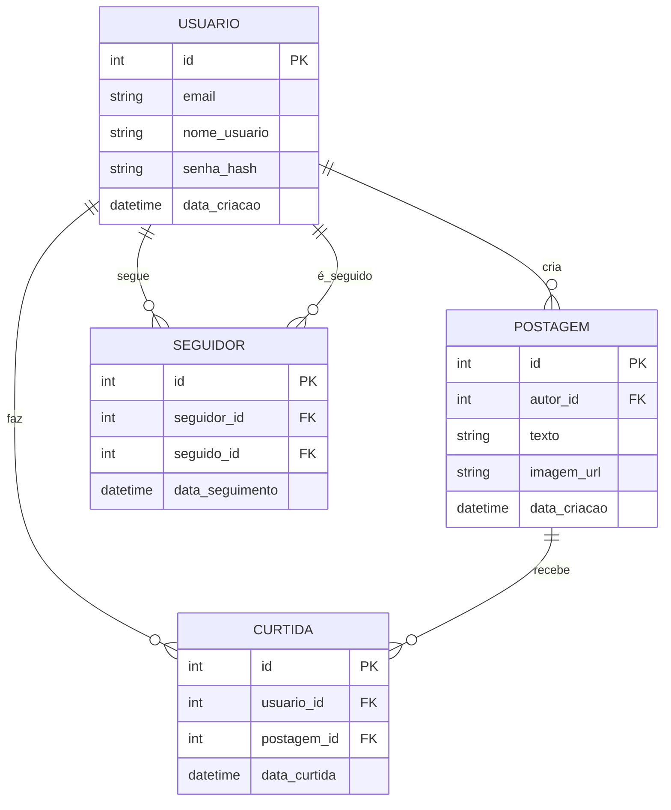

```mermaid
   erDiagram
    USUARIO ||--o{ POSTAGEM : cria
    USUARIO ||--o{ CURTIDA : faz
    POSTAGEM ||--o{ CURTIDA : recebe
    USUARIO ||--o{ SEGUIDOR : segue
    USUARIO ||--o{ SEGUIDOR : é_seguido

    USUARIO {
        int id PK
        string email
        string nome_usuario
        string senha_hash
        datetime data_criacao
    }

    POSTAGEM {
        int id PK
        int autor_id FK
        string texto
        string imagem_url
        datetime data_criacao
    }

    CURTIDA {
        int id PK
        int usuario_id FK
        int postagem_id FK
        datetime data_curtida
    }

    SEGUIDOR {
        int id PK
        int seguidor_id FK
        int seguido_id FK
        datetime data_seguimento
    }
```