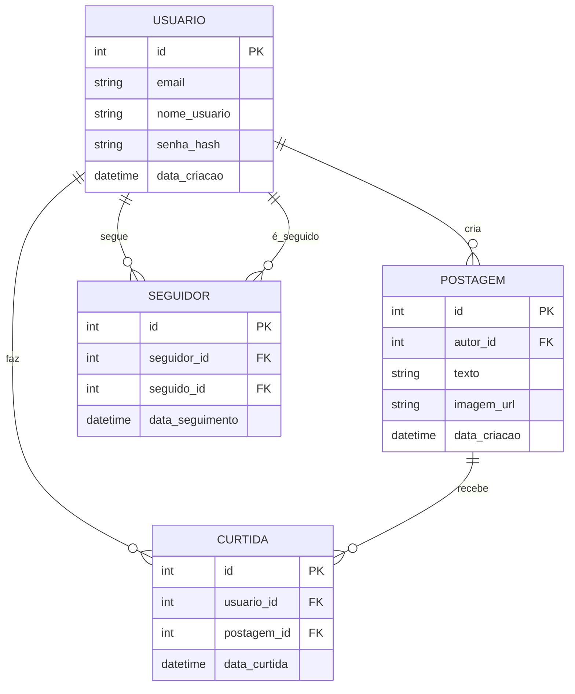

ENV: 
```bash	
DJANGO_SECRET_KEY="django-insecure-iy_lt*++uq##zoe0_^=5lem@6$nn^66xpei&ehre%e7f3wmkzh"
DEBUG=True
DJANGO_LOGLEVEL=info
DJANGO_ALLOWED_HOSTS=localhost
DATABASE_ENGINE=postgresql
DATABASE_NAME=postgres
DATABASE_USERNAME=postgres
DATABASE_PASSWORD=postgres
DATABASE_HOST=db
DATABASE_PORT=5432
```